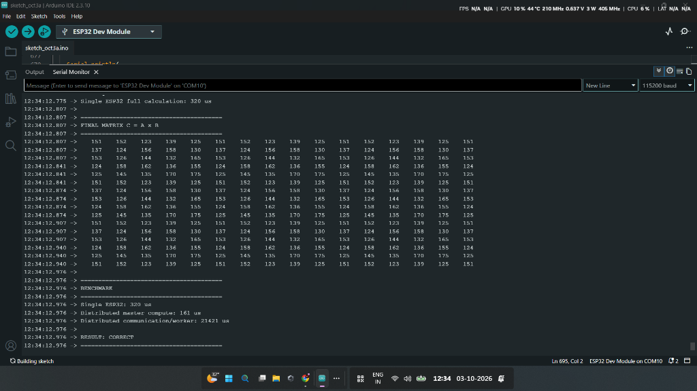

# ESP32 Distributed INT8 Machine Learning Accelerator

An experimental embedded computing project implementing distributed INT8 neural network inference across two physical ESP32 microcontrollers communicating over connectionless ESP-NOW.

---

## Overview

This project investigates the engineering mechanics and performance boundaries of **distributed neural network inference on bare-metal microcontrollers**. By partitioning a quantized Multi-Layer Perceptron (MLP) across two ESP32 microcontrollers—designated as **Master** and **Worker**—the system evaluates whether dividing matrix arithmetic over low-power wireless links provides practical advantages at micro-scale.

This is **not** an Internet of Things (IoT) project. It contains no sensor telemetry, cloud webhooks, home automation routines, or MQTT brokers. Instead, it treats low-cost microcontrollers as distributed parallel compute nodes to empirically measure the trade-off between **microsecond-scale integer computation** and **millisecond-scale wireless communication overhead**.

---

## Project Motivation

Modern TinyML typically focuses on optimizing inference on a single constrained microcontroller using pruning, quantization, or specialized hardware peripherals. However, as edge neural networks grow in parameter count, single-chip SRAM and compute constraints quickly become bottlenecks.

Distributed edge computing presents a potential path forward: pooling the memory and compute capacity of multiple networked microcontrollers. However, distributed computing introduces communication overhead. 

The primary questions addressed by this project are:
1. Can an INT8 neural network layer be partitioned and executed across separate microcontrollers with bit-exact parity against a unified single-device reference execution?
2. What is the quantitative relationship between embedded INT8 computational latency and low-level wireless link latency (ESP-NOW)?
3. At what workload scale does distributed execution become viable on resource-constrained embedded systems?

---

## Key Features

* **Distributed Model Parallelism:** Slices the hidden layer across two independent microcontrollers executing in parallel.
* **Pure Integer Arithmetic:** Implemented manually in C/C++ using INT8 inputs and weights with INT32 accumulators to prevent overflow and avoid floating-point overhead.
* **Low-Latency Wireless Link:** Uses connectionless ESP-NOW (raw IEEE 802.11 Vendor-Specific Action Frames) locked to 2.4 GHz Channel 1 to minimize networking overhead.
* **Deterministic Verification Engine:** The Master node calculates an independent single-chip reference inference per cycle and performs bit-for-bit parity validation against the distributed result.
* **High-Resolution Microsecond Benchmarking:** Direct hardware instrumentation via `micros()` tracking Layer 1 master execution, worker compute time, output layer time, turnaround latency, and baseline execution.
* **Transparent Latency Accounting:** Complete empirical disclosure distinguishing computation time from wireless frame transit.

---

## System Architecture

The computation is coordinated between two ESP32 nodes connected via peer-to-peer ESP-NOW:

```text
                    INT8 INPUT
                  [16 Dimensions]
                        │
                        ▼
              ┌─────────────────┐
              │    ESP32 #1     │
              │     MASTER      │
              │ Hidden 0–7      │
              └────────┬────────┘
                       │
                    ESP-NOW
             (InferencePacket, 21 B)
                       │
              ┌────────▼────────┐
              │    ESP32 #2     │
              │     WORKER      │
              │ Hidden 8–15     │
              └────────┬────────┘
                       │
                  Activations
             (WorkerResult, 41 B)
                       │
                       ▼
              ┌─────────────────┐
              │    ESP32 #1     │
              │  Output Layer   │
              │    16 → 4       │
              └────────┬────────┘
                       │
                       ▼
                  4 OUTPUTS
```

---

## Neural Network Architecture

The neural network is a fully connected Multi-Layer Perceptron (MLP) structured as **16 → 16 → 4**:

| Layer | Input Dimension | Output Dimension | Activation | Weight Dimensions | Storage Format |
|:---|:---:|:---:|:---:|:---:|:---:|
| **Layer 1 (Hidden)** | 16 | 16 | ReLU | $16 \times 16$ (256 weights) | INT8 |
| **Layer 2 (Output)** | 16 | 4 | ReLU | $4 \times 16$ (64 weights) | INT8 |

* **Input Vector:** 16 quantized signed 8-bit integers ($\mathbf{x} \in \mathbb{Z}^{16}, x_i \in [-128, 127]$).
* **Layer 1 Biases:** 16 signed 32-bit integers ($\mathbf{b}_1 \in \mathbb{Z}^{16}$).
* **Layer 2 Biases:** 4 signed 32-bit integers ($\mathbf{b}_2 \in \mathbb{Z}^{4}$).
* **Intermediate Activations:** Signed 32-bit integers ($\mathbf{h} \in \mathbb{Z}^{16}$).
* **Outputs:** 4 signed 32-bit integers ($\mathbf{y} \in \mathbb{Z}^{4}$).

The neural network is implemented manually in standard C/C++ arithmetic without relying on third-party ML runtime engines (such as TensorFlow Lite for Microcontrollers or Edge Impulse).

---

## Distributed Computation

The 16-neuron hidden layer is split symmetrically across both physical devices:

### ESP32 #1 (Master Node)
* Stores weight partition $\mathbf{W}_{1,\text{master}} \in \mathbb{Z}^{8 \times 16}$ and bias partition $\mathbf{b}_{1,\text{master}} \in \mathbb{Z}^{8}$.
* Computes hidden neurons 0 through 7 locally.
* Packs the 16-byte input vector into an ESP-NOW frame and transmits it to the Worker.
* Awaits worker response and unmarshals intermediate activations for neurons 8 through 15 into the shared activation buffer.
* Computes the final output layer (neurons 0–3) across the aggregated 16 hidden activations.
* Executes an independent reference inference locally.
* Validates parity between the distributed inference output and reference output.
* Collects and reports microsecond timing metrics.

### ESP32 #2 (Worker Node)
* Stores weight partition $\mathbf{W}_{1,\text{worker}} \in \mathbb{Z}^{8 \times 16}$ and bias partition $\mathbf{b}_{1,\text{worker}} \in \mathbb{Z}^{8}$.
* Listens continuously for inbound ESP-NOW packets from the Master.
* Computes hidden neurons 8 through 15 upon packet reception.
* Applies the ReLU activation function to its 8 computed values.
* Records local execution latency in microseconds.
* Transmits the 8 intermediate activations along with compute latency back to the Master via ESP-NOW.

---

## ESP-NOW Communication

Inter-node communication relies on **ESP-NOW**, Espressif’s connectionless data-link-layer protocol that encapsulates arbitrary payloads inside IEEE 802.11 Vendor-Specific Action Frames.

### Protocol Characteristics
* **Physical Transport:** 2.4 GHz ISM Band, locked to Channel 1 (`WIFI_SECOND_CHAN_NONE`).
* **Frame Overhead:** Eliminates IP/UDP headers, TCP connection states, handshakes, and routing tables.
* **Payload Transmission:** Direct MAC-to-MAC addressing between Master and Worker.

### Packet Structures

#### Master to Worker: `InferencePacket`
```cpp
typedef struct {
  uint8_t type;               // Packet type (1 = Inference Request)
  uint32_t sequence;          // Monotonic sequence number
  int8_t input[INPUT_SIZE];   // 16-element INT8 input vector (16 bytes)
} InferencePacket;
```
*Total Payload Size:* 21 bytes.

#### Worker to Master: `WorkerResult`
```cpp
typedef struct {
  uint8_t type;                         // Packet type (2 = Worker Response)
  uint32_t sequence;                    // Echoed sequence number
  int32_t hidden[WORKER_NEURONS];       // 8 computed activations in INT32 (32 bytes)
  uint32_t computeTimeUs;               // Worker compute duration in microseconds (4 bytes)
} WorkerResult;
```
*Total Payload Size:* 41 bytes.

---

## Numerical Computation

To ensure high compute density without floating-point emulation penalties, the entire pipeline utilizes integer arithmetic:

### 1. Matrix-Vector Multiplication with Accumulation
For each neuron $j$:
$$\text{sum}_j = b_j + \sum_{i=0}^{15} x_i \cdot w_{j,i}$$

Each multiplication is performed as:
```cpp
int32_t sum = B1_master[neuron];
for (int i = 0; i < INPUT_SIZE; i++) {
  sum += (int32_t)packet.input[i] * (int32_t)W1_master[neuron][i];
}
```
* Multiplication: INT8 $\times$ INT8 produces signed 16-bit products.
* Accumulation: Handled in 32-bit signed integer registers (`int32_t`), guaranteeing zero numerical overflow across the summation.

### 2. Rectified Linear Unit (ReLU)
Non-linear activation is applied directly on the accumulator before storing intermediate or final activations:
```cpp
if (sum < 0)
  sum = 0;
```

---

## Hardware Requirements

* **2× ESP32 Development Boards** (NodeMCU-32S, ESP32-WROOM-32, or equivalent).
* **1× Micro-USB / USB-C Data Cable** for flashing firmware and reading Master serial output.
* **1× Secondary 5V Power Source** (e.g., USB port, power bank, or regulated 5V power supply) to power the Worker during operation.

---

## Software Requirements

* **Arduino IDE** (v2.0+ recommended) or **VS Code + PlatformIO**.
* **Espressif ESP32 Arduino Core** (v2.0.x or v3.0.x).
* **Built-in ESP32 Libraries:**
  * `<WiFi.h>`
  * `<esp_now.h>`
  * `<esp_wifi.h>`

No external machine learning or mathematical libraries are required.

---

## Project Structure

```
esp32-distributed-ml-accelerator/
├── README.md                          # Comprehensive project documentation
├── ESP32_Master/
│   └── ESP32_Master.ino               # Master coordinator & inference firmware
├── ESP32_Worker/
│   └── ESP32_Worker.ino               # Worker coprocessor firmware
├── benchmarks/
│   └── benchmark-results.md           # Latency breakdown and scaling analysis
├── docs/
│   └── architecture.md                # System topology, math, and packet layouts
├── images/
│   └── benchmark-result.png           # Serial monitor screenshot of verified run
└── LICENSE                            # MIT License
```

---

## How It Works

1. **Initialization:** Both boards initialize their Wi-Fi transceivers in Station Mode (`WIFI_STA`), configure their radios to Channel 1, register ESP-NOW send/receive callbacks, and establish peer pairings using hardware MAC addresses.
2. **Inference Trigger:** The Master generates an INT8 input vector and increments a sequence counter.
3. **Local Partial Inference:** Master computes hidden neurons 0–7 and applies ReLU.
4. **Packet Dispatch:** Master transmits the 16 INT8 values to the Worker using ESP-NOW.
5. **Remote Partial Inference:** Worker receives the packet, computes hidden neurons 8–15, applies ReLU, measures its execution time, and transmits the resulting activations back to the Master.
6. **Recombination:** Master unpacks the 8 returned activations into the upper partition of the hidden layer buffer (`hidden[8..15]`).
7. **Output Layer Computation:** Master executes the 4 output neurons across all 16 assembled hidden activations.
8. **Independent Reference Execution:** Master calculates the entire 16-neuron network locally.
9. **Bit-Level Verification:** Master compares the distributed output vector with the reference output vector, asserting parity.
10. **Telemetry Reporting:** Master prints complete microsecond timing metrics and verification status to the serial console.

---

## Installation

1. Clone or download this repository:
   ```bash
   git clone https://github.com/Udaykiranjammula-alpha/esp32-distributed-ml-accelerator.git
   cd esp32-distributed-ml-accelerator
   ```

2. Open the Arduino IDE. Ensure the ESP32 board support package is installed:
   * **Preferences** $\to$ **Additional boards manager URLs**:
     `https://raw.githubusercontent.com/espressif/arduino-esp32/gh-pages/package_esp32_index.json`
   * **Tools** $\to$ **Board** $\to$ **Boards Manager** $\to$ search for `esp32` and install.

---

## ESP32 #1 Setup

1. Connect **ESP32 #1 (MASTER)** to your computer via USB.
2. Open [`ESP32_Master/ESP32_Master.ino`](ESP32_Master/ESP32_Master.ino).
3. If using custom hardware, update `workerMAC` to match the physical MAC address of your worker board:
   ```cpp
   uint8_t workerMAC[] = { 0x00, 0x70, 0x07, 0xE2, 0x16, 0xF0 }; // Replace with Worker MAC
   ```
4. Select your board model (e.g., `ESP32 Dev Module`) and target COM port.
5. Compile and upload the sketch.

---

## ESP32 #2 Setup

1. Connect **ESP32 #2 (WORKER)** to your computer via USB.
2. Open [`ESP32_Worker/ESP32_Worker.ino`](ESP32_Worker/ESP32_Worker.ino).
3. If using custom hardware, update `masterMAC` to match the physical MAC address of your master board:
   ```cpp
   uint8_t masterMAC[] = { 0x00, 0x70, 0x07, 0x2C, 0xE5, 0x68 }; // Replace with Master MAC
   ```
4. Select your board model and target COM port.
5. Compile and upload the sketch.

> [!NOTE]
> To discover the MAC address of an unconfigured ESP32 board, run `WiFi.macAddress()` in a minimal sketch.

---

## Running the System

1. Power both ESP32 boards (Worker can run from an external 5V power bank or second USB port).
2. Open the Arduino Serial Monitor connected to **ESP32 #1 (MASTER)**.
3. Configure baud rate to **115200 baud**.
4. Press the **EN / RESET** button on the Worker first, then on the Master.
5. The Master will periodically execute inferences and output execution telemetry to the console.

---

## Benchmark Results

The following execution metrics were empirically recorded from the tested physical implementation:

| Component | Measured Time | Category |
|:---|:---:|:---|
| **Single ESP32 inference** | **22 µs** | Unified Computation (Baseline) |
| **Master Layer 1** | **9 µs** | Computation (Neurons 0–7) |
| **Worker Layer 1** | **13 µs** | Computation (Neurons 8–15) |
| **Output Layer** | **4 µs** | Computation (Neurons 0–3) |
| **Communication + Worker** | **3754 µs** | Wireless Round-Trip + Remote Execution |
| **Verification** | **RESULT: CORRECT** | Parity Verification vs Reference |



---

## Performance Analysis

### Computation vs. Communication Trade-off

The empirical data demonstrates a fundamental principle in distributed computing: **computation-to-communication ratio determines parallel scaling efficiency**.

1. **Computation Latency (Microsecond-Scale):**
   * Evaluating 8 INT8 neurons on the ESP32 takes **9–13 µs**.
   * The complete single-node reference inference requires only **22 µs**.
   * Because the Xtensa LX6 runs at 240 MHz, single-cycle integer arithmetic executes small matrix multiplications in a few thousand CPU cycles.

2. **Communication Latency (Millisecond-Scale):**
   * The round-trip wireless turnaround time is **3754 µs** (~3.75 ms).
   * Subtracting the worker's computation time ($13\ \mu\text{s}$) leaves a net network round-trip overhead of **3741 µs**.
   * This includes 802.11 frame serialization, RF carrier sensing, RF transceiver state switching, interrupt handling, and queue dispatch.

### Key Observation

$$\text{Communication Overhead } (3741\ \mu\text{s}) \approx 170\times \text{ Single-ESP32 Compute Time } (22\ \mu\text{s})$$

For small neural network layers, **distributed computation over wireless links is not faster than single-device execution**. The latency incurred by sending packets over the air far exceeds the microsecond computational savings achieved by splitting the matrix arithmetic.

Distributed execution is only mathematically advantageous when local computation time exceeds round-trip transmission overhead:
$$T_{\text{comm}} < T_{\text{compute}}(\text{single}) - T_{\text{compute}}(\text{distributed})$$

On low-power wireless links, this condition is only met when layer dimensions are significantly larger (e.g., hundreds or thousands of neurons per layer) or when multiple inferences are batched into single frame payloads.

---

## Verification

The Master node performs runtime validation of the distributed execution against an independent reference engine:

```text
Running single-ESP32 reference...
Single ESP32 inference: 22 us

========================================
ML BENCHMARK
========================================
Single ESP32: 22 us
Master Layer 1: 9 us
Worker Layer 1: 13 us
Output Layer: 4 us
Total communication + worker: 3754 us

RESULT: CORRECT
========================================
```

* **Functional Determinism:** Every output element generated by combining the distributed partitions matches the single-node calculation bit-for-bit:
  `output[i] == referenceOutput[i]` $\forall i \in [0, 3]$.
* Confirms that integer quantization and partitioned accumulation can be distributed across bare-metal microcontrollers without numerical deviation or precision loss.

---

## Limitations

* **Communication Latency:** ESP-NOW frame exchange introduces approximately 3.7 ms of round-trip latency, dominating total runtime.
* **Workload Granularity:** The 16 → 16 → 4 network topology is computationally small, placing the system deep inside the communication-bound regime.
* **Non-Parallel Speedup:** Distributed execution in this specific test is slower in wall-clock time than single-device execution due to communication overhead.
* **Proof-of-Concept Design:** The implementation demonstrates distributed INT8 compute mechanics; weights and biases are manually configured rather than imported from an exported training checkpoint.
* **RF Environment Sensitivity:** Turnaround latency is subject to 2.4 GHz RF channel congestion, frame retransmissions, and environmental noise.

---

## Future Improvements

The following areas represent potential directions for continuing this line of research:

* **Batch Inference:** Amortize wireless packet overhead by bundling multiple input vectors into single 250-byte ESP-NOW payloads.
* **Larger Matrix Topologies:** Benchmark larger hidden layer dimensions ($64, 128, 256+$ neurons) to determine the empirical crossover point where distributed compute breaks even with single-device compute.
* **Pipelined Execution:** Implement double-buffering to overlap communication of input $N+1$ with computation of input $N$.
* **Multi-Node Cluster Scaling:** Extend the topology to 4 or 8 worker ESP32 nodes using broadcast or ring-topology communication.
* **Fixed-Point Quantization Optimization:** Integrate scaled fixed-point quantization schemes (e.g., Q7.8, asymmetric INT8 zero-point arithmetic).
* **Hardware Accelerators:** Utilize ESP32 dual-core FreeRTOS task pinning to run communication on Core 0 and SIMD/MAC computation on Core 1.
* **Energy & Power Benchmarking:** Measure power draw and energy-per-inference metrics (Joules/inference) comparing distributed execution against single-chip active time.

---

## Technical Concepts

* **Model Parallelism:** Slicing weight matrices across independent processing nodes so each node holds a subset of layer parameters.
* **INT8 Quantization:** Representing weights and inputs as 8-bit signed integers to maximize arithmetic throughput and minimize RAM requirements.
* **Accumulation Headroom:** Using 32-bit integer registers during matrix dot products to prevent arithmetic overflow before activation clamping.
* **Connectionless Action Frames:** Using 802.11 Layer-2 vendor frames to eliminate the 3-way TCP handshake and IP header overhead.
* **Communication-to-Computation Ratio:** The ratio of time spent transferring data across the network to time spent executing math on the CPU.

---

## Author

**Uday**  
Embedded Systems & Machine Learning Engineering

---

## Project Summary

This project implements distributed INT8 neural network inference across two ESP32 microcontrollers communicating over connectionless ESP-NOW. By partitioning a 16 → 16 → 4 Multi-Layer Perceptron across a Master and Worker node, the system verifies bit-exact inference parity against a unified single-device reference while measuring microsecond-level execution timing. The experimental results reveal that while embedded INT8 computation completes in microsecond-scale durations (9–13 µs), wireless communication overhead operates on a millisecond scale (~3.7 ms). This establishes an empirical case study on the communication-versus-computation trade-off in distributed edge TinyML systems.
